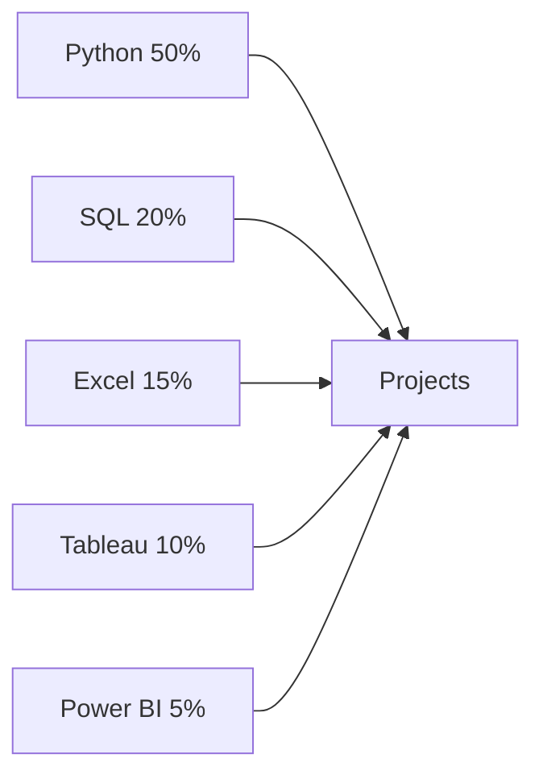

# 👋 Hi, I'm [Your Name]!

Welcome to my GitHub! I am a passionate [Your Role, e.g., "Data Scientist", "Software Developer"] with expertise in [Your Key Skills].

---

## 📊 My GitHub Stats

### Skills and Tools
Below is a breakdown of the tools and technologies I use, with the percentage of how often I've used them in my projects:

### Projects Overview

| **Project Name**               | **Description**                                                                 | **Tools Used**               |
|--------------------------------|---------------------------------------------------------------------------------|-----------------------------|
| Fraud Detection                | Built a model to detect fraudulent transactions with 99% accuracy               | Python, Scikit-Learn        |
| EV Sales Analysis              | Analyzed EV sales trends in India and created visualizations                    | SQL, Tableau, Power BI      |
| Calories Burnt Prediction      | Developed a calorie prediction model using regression techniques                 | Python, Pandas, Matplotlib  |
| Restaurant Data Analysis       | Identified trends in restaurant data to improve business decision-making         | Python, Seaborn, Pandas     |
| Music Store SQL Analysis       | Conducted advanced SQL queries to identify sales gaps                           | SQL                         |

---

## 🌟 What I Work On

### Languages
- Python
- SQL
- R (beginner)

### Tools and Frameworks
- Tableau
- Power BI
- Scikit-Learn
- Pandas, NumPy, Matplotlib

### Certifications
- Six Sigma Black Belt & Green Belt
- Fraud Detection & Analysis
- Advanced Excel

---

## 🏆 Highlights
- **15+ projects** completed successfully
- **Employee of the Year** award in 2023
- Consistently delivered accurate analyses with actionable insights

---

Feel free to connect with me for any collaborations or queries! 🚀
